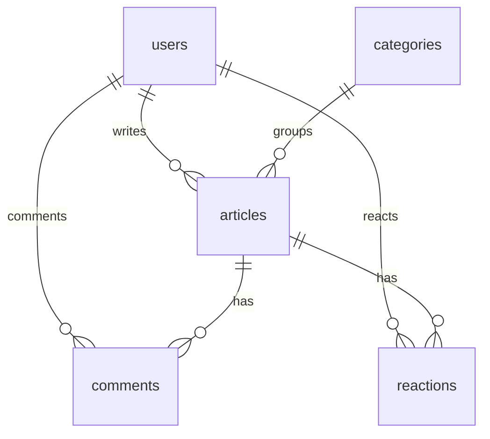

# 个人博客数据库设计

## 概览

数据库：MySQL 8.x  
字符集：`utf8mb4`  
排序规则：`utf8mb4_unicode_ci`

核心表：

- `users`：用户与站长账号
- `categories`：文章分类
- `articles`：文章主体
- `comments`：文章评论
- `reactions`：点赞和收藏记录

## ER 关系

## users

用户表。第一位注册用户由后端自动设置为 `admin`。

| 字段 | 类型 | 约束 | 说明 |
| --- | --- | --- | --- |
| `id` | bigint unsigned | PK, auto increment | 用户 ID |
| `created_at` | datetime(3) | nullable | 创建时间 |
| `updated_at` | datetime(3) | nullable | 更新时间 |
| `deleted_at` | datetime(3) | index, nullable | 软删除时间 |
| `name` | varchar(64) | not null | 昵称 |
| `email` | varchar(128) | unique, not null | 邮箱 |
| `password_hash` | varchar(255) | not null | bcrypt 密码哈希 |
| `role` | varchar(16) | not null, default `user` | `user` 或 `admin` |

索引：

- `idx_users_deleted_at`：软删除查询
- `uni_users_email`：邮箱唯一

## categories

文章分类表。

| 字段 | 类型 | 约束 | 说明 |
| --- | --- | --- | --- |
| `id` | bigint unsigned | PK, auto increment | 分类 ID |
| `created_at` | datetime(3) | nullable | 创建时间 |
| `updated_at` | datetime(3) | nullable | 更新时间 |
| `name` | varchar(64) | unique, not null | 分类名 |
| `slug` | varchar(80) | unique, not null | URL 标识 |

索引：

- `uni_categories_name`：分类名唯一
- `uni_categories_slug`：分类 slug 唯一

## articles

文章表。正文使用 Markdown 存储。

| 字段 | 类型 | 约束 | 说明 |
| --- | --- | --- | --- |
| `id` | bigint unsigned | PK, auto increment | 文章 ID |
| `created_at` | datetime(3) | nullable | 创建时间 |
| `updated_at` | datetime(3) | nullable | 更新时间 |
| `title` | varchar(180) | not null | 文章标题 |
| `slug` | varchar(220) | unique, not null | URL 唯一标识 |
| `summary` | text | nullable | 摘要 |
| `cover_url` | varchar(500) | nullable | 封面图 URL |
| `content` | longtext | not null | Markdown 正文 |
| `tags` | text | nullable | 英文逗号分隔标签 |
| `status` | varchar(16) | index, not null, default `draft` | `draft` 或 `published` |
| `published_at` | datetime(3) | nullable | 发布时间 |
| `category_id` | bigint unsigned | index, nullable | 分类 ID |
| `author_id` | bigint unsigned | index, not null | 作者 ID |
| `likes_count` | bigint | not null, default `0` | 点赞数 |
| `favorites_count` | bigint | not null, default `0` | 收藏数 |

索引：

- `uni_articles_slug`：文章 slug 唯一
- `idx_articles_status`：公开列表过滤
- `idx_articles_category_id`：分类筛选
- `idx_articles_author_id`：作者查询
- `idx_articles_published_at`：发布时间排序
- `idx_articles_search`：标题、摘要、标签模糊搜索辅助索引

## comments

评论表。

| 字段 | 类型 | 约束 | 说明 |
| --- | --- | --- | --- |
| `id` | bigint unsigned | PK, auto increment | 评论 ID |
| `created_at` | datetime(3) | nullable | 创建时间 |
| `updated_at` | datetime(3) | nullable | 更新时间 |
| `article_id` | bigint unsigned | index, not null | 文章 ID |
| `user_id` | bigint unsigned | index, not null | 评论用户 ID |
| `body` | text | not null | 评论内容 |
| `status` | varchar(16) | index, not null, default `published` | `published` 或 `hidden` |

索引：

- `idx_comments_article_id`：文章评论列表
- `idx_comments_user_id`：用户评论查询
- `idx_comments_status`：公开评论过滤

## reactions

互动表。点赞和收藏都存在这一张表里。

| 字段 | 类型 | 约束 | 说明 |
| --- | --- | --- | --- |
| `id` | bigint unsigned | PK, auto increment | 互动 ID |
| `created_at` | datetime(3) | nullable | 创建时间 |
| `updated_at` | datetime(3) | nullable | 更新时间 |
| `user_id` | bigint unsigned | unique group, not null | 用户 ID |
| `article_id` | bigint unsigned | unique group, index, not null | 文章 ID |
| `type` | varchar(16) | unique group, not null | `like` 或 `favorite` |

唯一约束：

- `ux_user_article_type`：同一用户对同一篇文章同一种互动只能存在一条记录

## 设计说明

- `articles.likes_count` 和 `articles.favorites_count` 是冗余计数字段，用于热门文章排序，真实明细在 `reactions` 表。
- `comments.status = hidden` 表示后台隐藏评论，不做硬删除。
- `articles.status = draft` 表示草稿，仅站长可在接口中预览。
- 未分类文章的 `articles.category_id` 存储为 `NULL`，接口层使用 `categoryId: 0` 表示未分类。
- 当前后端使用 GORM `AutoMigrate`，也可以直接执行 `database/schema.sql` 创建表。
- Redis 只缓存文章列表查询结果，不承担核心数据持久化。
